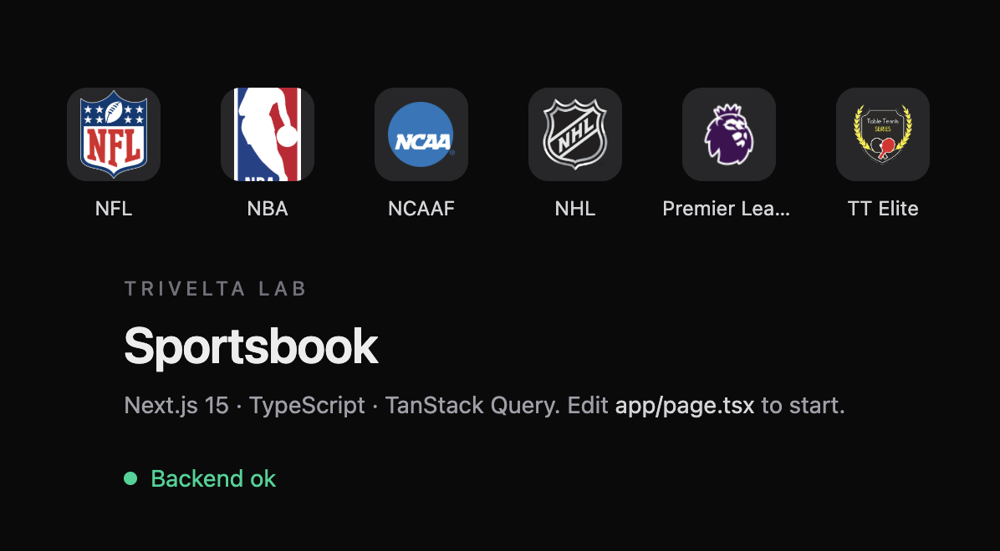

# Trivelta Lab

I used this lab to prep for an interview. I built a small sportsbook, inspired by Aigames: wallet, transactions, and a minimal frontend.




## What I built

Backend in FastAPI + SQLAlchemy + Alembic on Postgres. The schema ended up like this:

- `operators` → `players` → `wallets` (balance `Numeric(12, 2)`)
- `transactions` (`deposit`, `bet`, `payout`)

The problem I cared about was **not losing balance** when two requests hit at the same time: two 100 debits on a wallet with 100 cannot go negative or record the bet twice.

In `debit()` I used **pessimistic locking** (`SELECT … FOR UPDATE`) to serialize access to the row. The test `test_concurrent_debit_does_not_overdraft` fires two threads: one has to succeed and the other has to fail with `Insufficient balance`. What I expect at the end is `balance = 0` and **a single** transaction.

I also compared that with **optimistic locking** (version / `updated_at`): more throughput, but you have to retry when the other process wins the race.

On the frontend I used **Next.js 15 + TypeScript + TanStack Query**: backend health plus a league navbar (`/sports`) with logo + `display_name`.

## How to run it

```bash
# backend
cd backend
pip install -r requirements.txt
alembic upgrade head
uvicorn app.main:app --reload --port 8000

# frontend
cd frontend
npm install
cp .env.example .env.local
npm run dev
```

- API: [http://localhost:8000](http://localhost:8000)
- UI: [http://localhost:3000](http://localhost:3000)

## Takeaways

With Next in production (`next build` / `next start`) I have to **compile on every run**. It also ships ESLint: an `any` or a bad type kills the build. If you don't know those rules, they block you. The lesson I took away is to type the API JSON from the first request.

I still closed the lab: wallet model, locking, overdraft test, and the sportsbook on the frontend.
